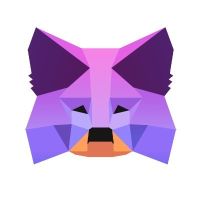
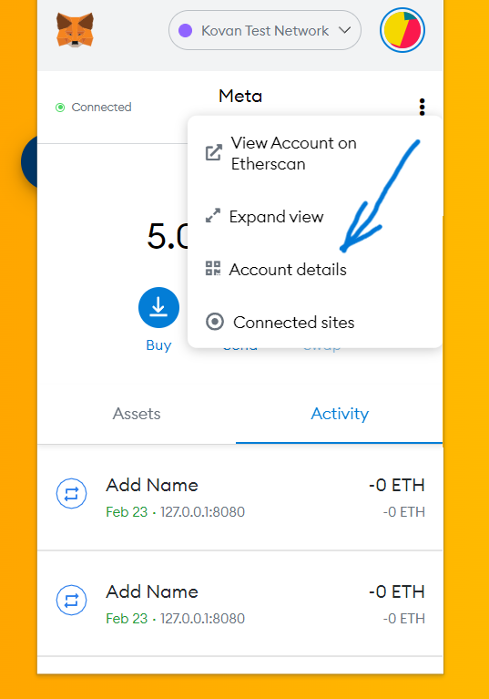
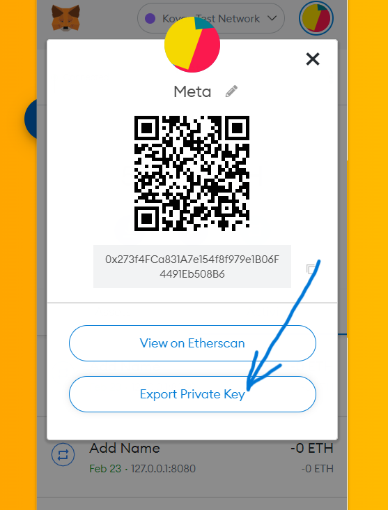
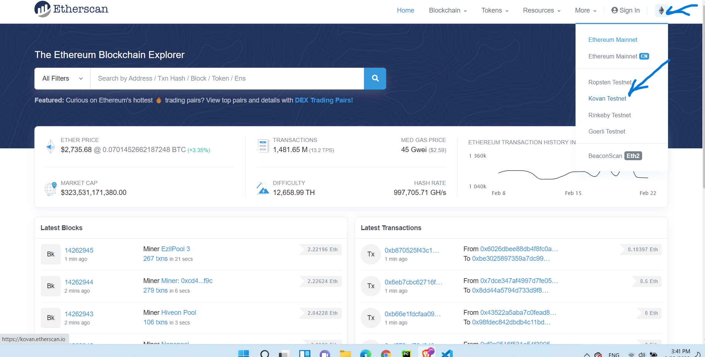
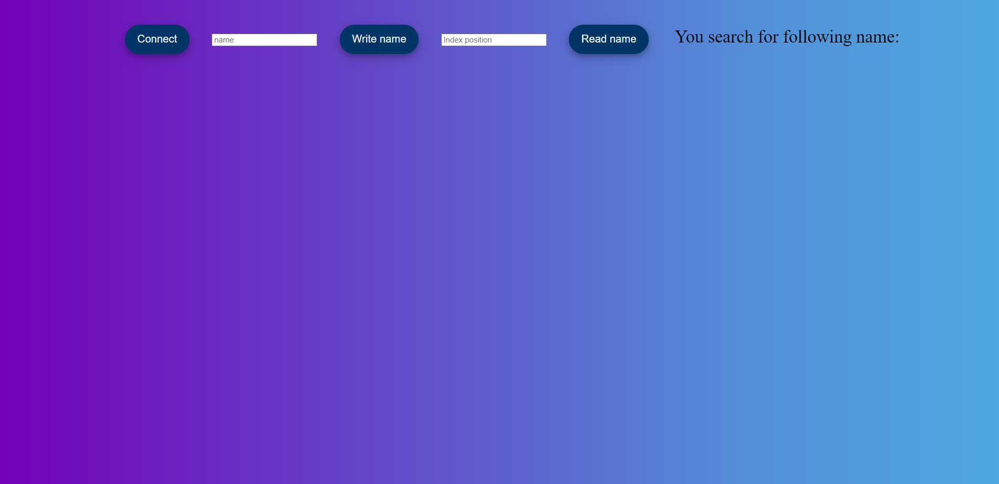

## Next.js DApp with MetaMask integration

Here you can find step by step guide on how to build DApp on Ethereum Kovan testnet by using React framework Next.js and how to integrate your Meta Mask wallet in your DApp.

From tooling for smart contract development we will use Python based Brownie framework. And for integration between our front-end and deployed smart contract we will use Ethers.js library.

 

### Step 1: Install dependencies, create new next-app and initiate new empty Brownie project

We assume that you already have installed on your local machine Python >= 3.6.0, Node, Yarn and Meta Mask extension (if you don't have please install them first and then move forward).

Let`s first create new next.js app.

    $ yarn create next-app nextjs_dapp
    $ cd nextjs_dapp

In nextjs_dapp we will use pipenv to creation virtual environment in which we will install
eth-brownie.

    $ pip install pipenv
    $ pipenv --version
    $ ...version 2022.1.8

Creating virtual environment

    $ pipenv shell
    $ ...Successfully created virtual environment!

Lets now install pipx (recommendent way to install eth-brownie)

    (your_venv)$ python3 -m pip install pipx
    (your_venv)$ python3 -m pipx ensurepath
    (your_venv)$ ...Otherwise pipx is ready to go! ✨ 🌟 ✨

Install Brownie

    (your_venv)$ pipx install eth-brownie
    (your_venv)$ ...done! ✨ 🌟 ✨

Ganache is used to create local blockchain for testing purpose (Brownie under the hood use also Ganache).

    (your_venv)$ yarn global add ganache-cli
    (your_venv)$ ganache-cli --version
    (your_venv)$ Ganache CLI v6.12.2 (ganache-core: 2.13.2)

### Starting new Brownie project

    (your_venv)$ brownie init dapp_brownie

### Brownie folder structure inside dapp_brownie

 

    - build (result of compiling process: contracts ABI`s, json file with history of deployed contracts etc.)

    - contracts (smart contracts)

    - scripts (deploy scripts and other supporting functions)

    - tests (fixtures and test file)

## Step 2: Creating and compiling simple smart contract in Solidity

 

Go to dapp_brownie subfolder `/contract` and create file `SimpleContract.sol`

Inside that file past following Solidity code

    // SPDX-License-Identifier: MIT

    pragma solidity 0.8.0;

    contract SimpleContract {
        // Here we declar state varibale string type
        string[] public name;

        // This function take string input and append (write to blockchaine) to
        // our state variable (list)

        function addName(string memory _name) public {
            name.push(_name);
        }

        // This function pull name from indexed position we would like to see and
         // show us on the front-end (read from blockchain)

        function returnName(uint256 _index) public view returns (string memory) {
            return name[_index];
        }
    }

 

Then go back to shell and type

    $brownie compile

You should get something like

    # And you should get something like
    $Compiling contracts...
    Solc version: 0.8.0
    Optimizer: Enabled  Runs: 200
    EVM Version: Istanbul
    Generating build data...
    - SimpleContract

    Project has been compiled. Build artifacts saved at /home/ilijapet/my_tutorials/dapp_brownie/build/contracts

Cool now we have our smart contract compiled. There is three additional steps before we move on integration with front end:

1. Fund our account with Kovan testnet ETH
1. Write deploy script
1. Deploy smart contract to Kovan testnet

Testnet ETH you can get by passing your ETH addresses to following two sites

(here is where you can get address in MetaMask)

 

 

    https://faucet.paradigm.xyz/

or from Chainlink

    https://docs.chain.link/docs/link-token-contracts/#ethereum

After few seconds you should see in your wallet testnet ETH (please make sure that you change you network from mainnet to kovan)

 

 

Inside your Brownie project root directory maker .env file

    $vim .env

And inside .env file please add following elements

    # Here we have private key export
    PRIVATE_KEY="your_private_key_from_metamask"

    # Then we should add Infura entry point through which we will approach Ethereum blockchain
    export WEB3_INFURA_PROJECT_ID=your_kovan_testnet_infura_endpoint

 

BUT BEFORE YOU CONTINUE PLEASE:

1. DON'T USE PRIVATE KEYS FROM ACCOUNT YOU USE FOR ANY KIND OF REAL TRANSACTION. OPEN NEW PROFILE IN YOUR LET'S SAY BRAVE BROWSER AND INSIDE THAT NEW PROFILE INSTALL AGAIN METAMASK EXTENSION (WITH NEW SEED PHRASE). AND USE ONLY THAT WORKING PROFILE WHILE EXPERIMENTING AND DEVLOPING YOUR DApps.

2. PLEASE ADD .ENV FILE TO YOUR .GITIGNORE FILE!

Way to get private keys from your Meta Mask is

Way to get your Infura end-point is over infura.io (or Alchemy or other Ethereum node provider). Open your account there and find your Kovan keys (past to newly created .env file)

    https://infura.io/

Ones you get you private key and Infura endpoint for Kovan test net please past that values inside your .env file in Brownie project root directory (as we describe above).

Next step is to create very important brownie-config.yaml file (inside your `brownie_dev_folder`)

    $ vim brownie-config.yaml

Inside this file past following values

    dotenv: .env
    wallets:
        from_key: ${PRIVATE_KEY}

Ones we set up all those parameters it is time to write deploy script inside brownie `./scripts` folder

    $ vim deploy_contract.py

Inside `deploy_contract.py` file write following code:

    #!usr/bin/python3s
    from brownie import config, accounts, SimpleContract

    def main():

        # Get account from .env file and assigne to dev variable
        dev = accounts.add(config["wallets"]["from_key"])

        # Use this account to deploy smart contract
        SimpleContract.deploy({"from": dev})

Now run deploy script

    $brownie run scriptr/deploy_contract.py --network kovan

If everything goes well you should get something like:

    Brownie v1.17.2 - Python development framework for Ethereum

    SimplemetamaskintegrationProject is the active project.

    Running 'scripts/deploy_contract.py::main'...
    Transaction sent: 0xb162127d9ce5208c05767d94bef559bc8905e725ddb6dcb59fdf8ea0cde5d9d8
    Gas price: 2.500000007 gwei   Gas limit: 117775   Nonce: 401
    SimpleContract.constructor confirmed   Block: 29978713   Gas used: 107069 (90.91%)
    SimpleContract deployed at: 0x46B4af33eF967F11fAfCef5d53B5e79e52cf9cd8

Here Brownie informs us that deployment was successful and our smart contract is now living on Kovan testnet. We can check this by passing address to which contract is deployed `0x46B4af33eF967F11fAfCef5d53B5e79e52cf9cd8` to https://etherscan.io/ (Don't forget to change network to Kovan inside etherscan ones you are there. Right corner up)

 

Important: Brownie automatically take care about all addresses to which we deploy some version of our contract. And this is how we can always go back to some previous version. If you go to `./build/deployments` folder you will find `map.json` file. Inside that file you will see all Kovan addresses to which your smart contract has been deployed.

        {
        "42": {
            "SimpleContract": [
            "0xBe6f793D9C83fdD912D990C41e836E76594771c3",
            "0x4cff1166885e653f8640dbE43e955AEd79F9a745",
            "0x390DE56F529a1C9dd8CadD9F81beB1b7A7821EA8"
            ]
        }
        }

In same folder `./build/contracts` you have contracts ABI as result of our compilation process. This ABI, together with address of deployed contract and node provider are our main elements when we now start to build integration with front-end.

# Front-end and integration

Lets us now move to front-end and how we actually integrate our next.js app with functionality we have inside our smart contract.

From `nextjs_dapp` folder

    $cd pages

Inside that folder open `index.js` and erase existing code and past following one

 

    import style from "../styles/Home.module.css";
    import { useState, useEffect } from "react";
    import { ethers } from "ethers";

    export default function Home() {
      // defining useState
      const [isConnected, setIsConnected] = useState(false);
      const [buttonConnect, setButtonConnect] = useState("Connect");
      const [name, setName] = useState("");
      const [newName, setNewName] = useState("");
      const [indexPosition, setIndexPostion] = useState("");
      const [contract, setContract] = useState();

      const checkWalletExist = async () => {
        if (!ethereum) {
          alert("Make sure you have Metamask installed!");
        } else {
          console.log("Wallet exists! We're ready to go!");
        }
      };

      const checkIfIsConnected = async () => {
        const accounts = await ethereum.request({ method: "eth_accounts" });
        if (accounts.length !== 0) {
          setIsConnected(true);
          setButtonConnect("Connected");
        } else {
          setIsConnected(false);
          setButtonConnect("Connect");
        }
      };

      const createContractInterface = async () => {
        let provider = new ethers.providers.Web3Provider(window.ethereum);
        let signer = provider.getSigner();
        const contractAddress = "0x46B4af33eF967F11fAfCef5d53B5e79e52cf9cd8";
        const abi = [
          {
            inputs: [
              {
                internalType: "string",
                name: "_name",
                type: "string",
              },
            ],
            name: "addName",
            outputs: [],
            stateMutability: "nonpayable",
            type: "function",
          },
          {
            inputs: [
              {
                internalType: "uint256",
                name: "",
                type: "uint256",
              },
            ],
            name: "name",
            outputs: [
              {
                internalType: "string",
                name: "",
                type: "string",
              },
            ],
            stateMutability: "view",
            type: "function",
          },
          {
            inputs: [
              {
                internalType: "uint256",
                name: "_index",
                type: "uint256",
              },
            ],
            name: "returnName",
            outputs: [
              {
                internalType: "string",
                name: "",
                type: "string",
              },
            ],
            stateMutability: "view",
            type: "function",
          },
        ];
        setContract(new ethers.Contract(contractAddress, abi, signer));
      };

      const connectWallet = async () => {
        if (typeof window.ethereum !== "undefined") {
          try {
            await ethereum.request({ method: "eth_requestAccounts" });
            setIsConnected(true);
          } catch (e) {
            console.log(e);
          }
        } else {
          setIsConnected(false);
        }
      };

      const update = async (props) => {
        try {
          await contract.addName(props);
        } catch (err) {
          console.log(err);
        }
      };

      const read = async (props) => {
        try {
          const name = await contract.returnName(props);
          setName(name);
        } catch (err) {
          console.log(err);
        }
      };

      useEffect(() => {
        checkWalletExist();
      }, []);

      useEffect(() => {
        createContractInterface();
      }, []);

      useEffect(() => {
        checkIfIsConnected();
      });

      return (
        <>
          

            <button
              className={style.universalBtn}
              onClick={() => connectWallet()}
              disabled={isConnected}
            >
              {buttonConnect}
            </button>

            <input
              type="text"
              placeholder="name"
              value={newName}
              onChange={(e) => setNewName(e.target.value)}
            ></input>
            <button
              type="submit"
              className={style.universalBtn}
              onClick={() => update(newName)}
            >
              Write name
            </button>

            <input
              type="number"
              placeholder="Index position"
              value={indexPosition}
              onChange={(e) => setIndexPostion(e.target.value)}
            ></input>

            <button
              className={style.universalBtn}
              onClick={() => read(indexPosition)}
            >
              Read name
            </button>
             You search for following name: {name}
          

        </>
      );
    }

## CSS file

In `./style` folder of root directory open `Home.module.css` and `globals.css` files. Past inside `globals.css` file some basic styling:

    body {
    text-align: center;
    background: linear-gradient(
      to right,
      #7400b8,
      #6930c3,
      #5e60ce,
      #5390d9,
      #4ea8de
      );
     }

    span {
      font-size: 30px;
    }

Then inside `Home.module.css` past following code:

    .universalBtn {
      border: none;
      color: white;
      background-color: #003566;
      position: relative;
      padding: 15px 21px;
      margin: 1cm;
      border-radius: 30px;
      font-size: 18px;
      box-shadow: 0 4px 8px 0 rgba(0, 0, 0, 0.2), 0 6px 20px 0 rgba(0, 0, 0, 0.19);
    }

## Final step

From project root folder start server to see if everything works as we expect

    $yarn dev

And you should see something like this

    yarn run v1.22.17
    warning ../../package.json: No license field
    $ next dev
    ready - started server on 0.0.0.0:3000, url: http://localhost:3000
    event - compiled client and server successfully in 646 ms (124 modules)

Now you should be able to connect your Meta Mask, submit transaction to your smart contract and read from it.
And this basic pattern will emerge again and again through all your future DApps.

